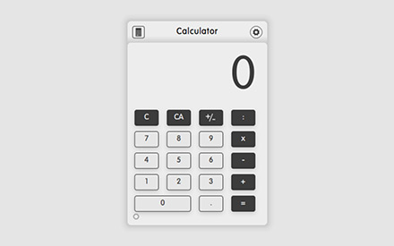
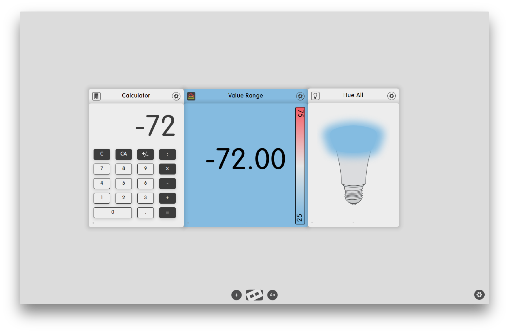

# Calculator

**Table of contents**

1. Screenshots
2. Description
3. What is new in V0.17
4. Works well with
4. Additional information

## Screenshots

## Description

A classic calculator.

## What is new in V0.17
* Improve docking.

### V0.14
* Add help.
* Bugfixes.

### V0.1
Build classic calculator.

## Works well with

Create your own signaling system when a calculation falls below or exceeds a threshold with Calculator, Value Range and All Hue.

Dock the Calculator dizmo with

* Converter
* Sticky Notes
* Value Range

## Additional information

Developer: dizmo AG
Contact: support@dizmo.com
Website: [www.dizmo.com](https://www.dizmo.com/)
